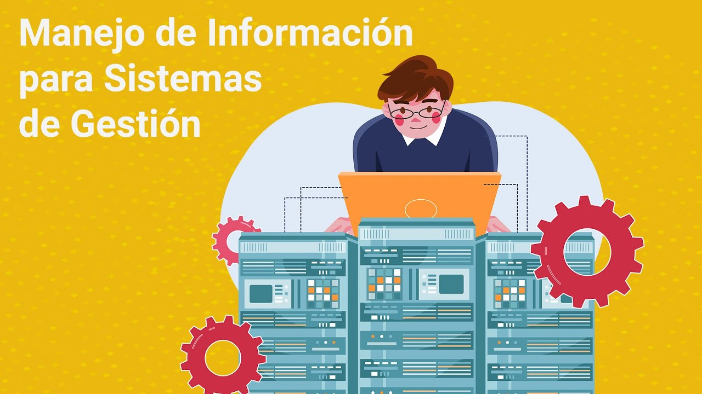

# ***Jose Juan Jorge Sosa***
------------------------------------------------------------

> ***Las Palmas de Gran Canaria***
>> ***Provincia Las Palmas***
>>> (IFCD0211)  SISTEMAS DE GESTIÓN DE INFORMACIÓN
------------------------------------------------------------

---------------------------------------------------------------

# ***Fuerteventura 2000 sl***

-----------------------

##  Cualificación profesional de referencia 

> #### IFC304_3 SISTEMAS DE GESTIÓN DE INFORMACIÓN (RD 1201/2007, de 14 de septiembre)   

- ### Unidades de competencia 

	-  ##### UC0966_3 
		- Consultar y extraer información de distintas plataformas de 
almacenamiento de datos. 

	-  ##### UC0967_3 
		- Crear y gestionar repositorios de contenidos 

	-  ##### UC0968_3 
		- Administrar el sistema de gestión de información 

-----------------------------------------------------------------------

### Ocupaciones o puestos de trabajo relacionados: 

1. Gestor de contenidos. 
2. Gestor de portales web. 
3. Administrador de sistemas de contenidos.
4. Integrador de sistemas de información.  

-------------------------------------------------------------------------

----------------------------------------------------------------------------

### Módulos certificado 

MF0966_3: Consulta y manipulación de información 
contenida en gestores de datos 

<sumary>

- UF2213
	> Modelos de datos y visión conceptual de una base de datos 
- UF2214
	> Implementación y uso de una BD 
- UF2215
	> Herramientas de los sistemas gestores de bases de datos. Pasarelas y medios de conexión 

</sumary>

MF0967_3: Creación y gestión de repositorios de contenidos
contenida en gestores de datos 

<sumary>

- UF2216
	> Repositorios de contenidos
- UF2217
	> Lenguaje XML 
- UF2218
	> Desarrollo de un CMS 

</sumary>

MF0968_3: Creación y gestión de repositorios de contenidos
contenida en gestores de datos 

<sumary>

- UF1643
	> Gestión y control de los Sistemas de información 
- UF1644
	> Canales de distribución y publicación utilizados en los sistemas gestores de información 

</sumary>

 -----------------------------------------

> MP0459: Módulo de prácticas profesionales no laborales. 

-----------------------------------------------
© 2025 José Juan Jorge Sosa. Todos los derechos reservados.

----------------------------------------------------
